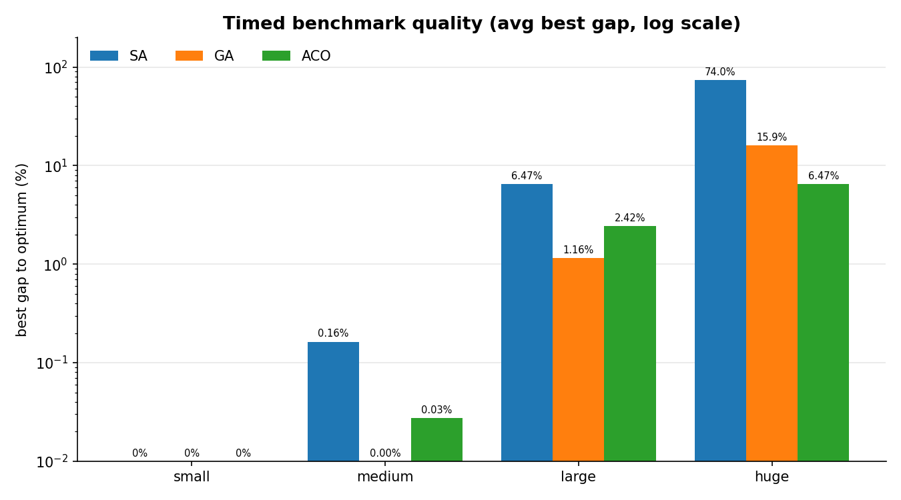
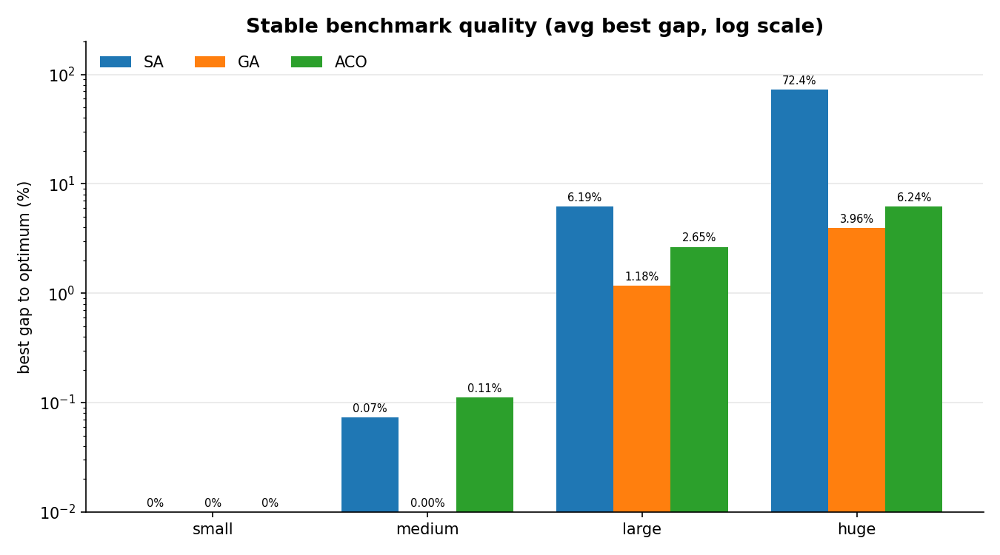
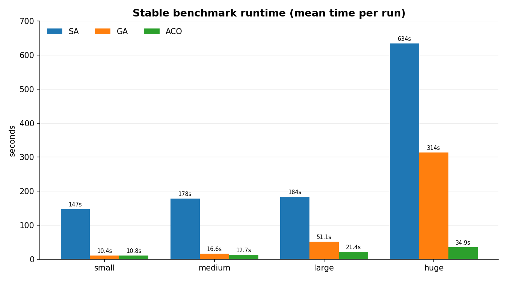
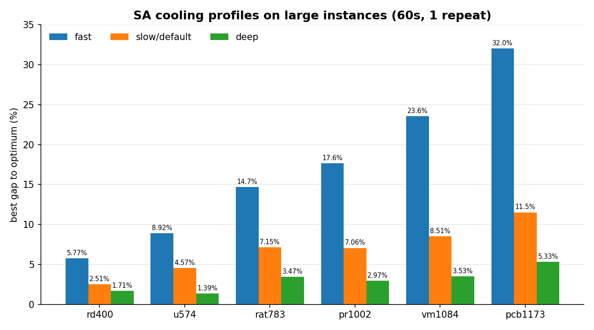
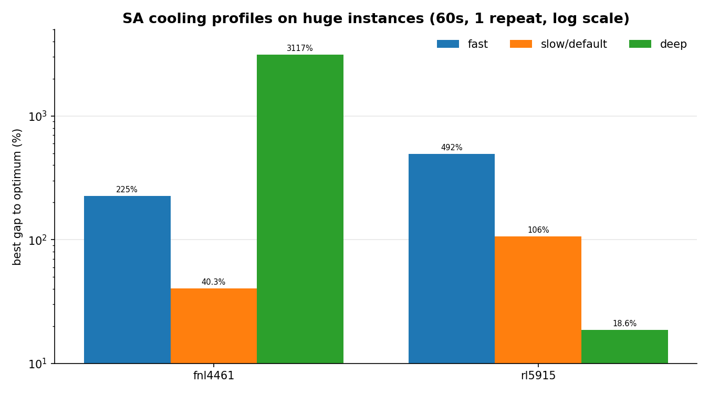

# TSP Optimization

C++17 project for experimenting with heuristic solvers for the Traveling Salesman Problem.

The project reads TSPLIB-style `EUC_2D` instances, runs several heuristic algorithms, and writes benchmark results to CSV files.

Implemented algorithms:

- Simulated Annealing
- Genetic Algorithm
- Ant Colony Optimization
- optional 2-opt local search improvement

The focus of the project is correctness, reproducible runs, and clear benchmarking.

## Features

- TSPLIB `EUC_2D` parser with input validation
- TSPLIB-style rounded Euclidean distance calculation
- tour validation based on city ids
- reproducible random seeds
- timed and stable benchmark modes
- per-algorithm config files
- CSV benchmark output
- CMake presets for debug, release, and sanitizer builds
- CTest tests for parser, tour validity, algorithms, stop logic, etc

## Project Structure

```text
algorithms/       SA, GA, and ACO implementations
benchmark/        benchmark runner and CSV output
benchmark_sets/   TSPLIB instances used by benchmarks
configs/          default and custom algorithm parameters
core/             TSPLIB parsing, distances, 2-opt, config, stop conditions
docs/assets/      benchmark charts used by this README
tests/            CTest-based correctness tests
tools/            helper scripts for generated README assets
tsplib/           TSPLIB instances and known best solutions
```

## Requirements

- CMake 3.21 or newer
- C++17 compiler

## Build

Release build:

```bash
cmake --preset release
cmake --build --preset release
```

The main executable is:

```bash
./build/release/tsp_optimizer
```

Debug build:

```bash
cmake --preset debug
cmake --build --preset debug
```

Sanitizer build:

```bash
cmake --preset sanitizers
cmake --build --preset sanitizers
```

## Run Tests

```bash
ctest --test-dir build/release --output-on-failure
```

For memory and undefined-behavior checks:

```bash
ctest --test-dir build/sanitizers --output-on-failure
```

## Run Benchmarks

Small timed benchmark:

```bash
./build/release/tsp_optimizer \
  --benchmark-mode timed \
  --set small \
  --algorithm all \
  --params default \
  --time-limit 10s \
  --seed 42 \
  --repeats 3
```

Medium timed benchmark:

```bash
./build/release/tsp_optimizer \
  --benchmark-mode timed \
  --set medium \
  --algorithm all \
  --params default \
  --time-limit 60s \
  --seed 42 \
  --repeats 3
```

Stable benchmark:

```bash
./build/release/tsp_optimizer \
  --benchmark-mode stable \
  --set small \
  --algorithm all \
  --params default \
  --seed 42 \
  --repeats 3
```

Benchmark CSV files are written to `results/`. This directory is ignored by git.

## Command Line Options

```text
--benchmark-mode timed|stable
--set small|medium|large|huge
--algorithm sa|ga|aco|all
--params default|custom
--config FILE
--two-opt true|false
--seed N
--repeats N
```

Timed mode also requires:

```text
--time-limit 10s
```

Stable mode accepts:

```text
--min-iters N
--window N
--epsilon VALUE
--plateau-time 60s
--max-iters N
```

## Benchmark Modes

### Timed Mode

Timed mode gives each algorithm a wall-clock time budget.

This is useful when you want to compare practical performance under the same time limit.

For Simulated Annealing, one useful unit of work is a full cooling schedule. If the time limit is very small, SA may not finish even one full annealing chain. In that case the result can be much worse than a normal SA run. Use larger time limits for SA when comparing it seriously.

Example:

```bash
./build/release/tsp_optimizer --benchmark-mode timed --set small --algorithm all --time-limit 10s
```

### Stable Mode

Stable mode is a best-effort mode.

It lets each algorithm run until it stops improving for a while. This is not an equal-time comparison. It is useful for checking what each algorithm can reach when it is allowed to finish its natural work cycle.

For GA and ACO, stability is checked over generations or epochs.

For SA, stability is checked over completed annealing restarts. SA is not stopped in the middle of a cooling schedule just because the current best cost has not improved yet.

## Configuration

Default configs are stored in:

```text
configs/default/
```

SA also has a few manual profiles:

```text
configs/sa/fast.conf
configs/sa/slow.conf
configs/sa/deep.conf
```

Example GA config:

```conf
population = 100
mutation = 0.1
two_opt = true
```

Run with a custom config:

```bash
./build/release/tsp_optimizer \
  --benchmark-mode timed \
  --set medium \
  --algorithm sa \
  --params custom \
  --config configs/sa/slow.conf \
  --time-limit 60s \
  --seed 42
```

You can also override 2-opt from the command line:

```bash
--two-opt true
--two-opt false
```

## Algorithms

### Simulated Annealing

Simulated Annealing starts from a tour, makes random moves, and sometimes accepts worse moves early in the run. This helps it escape local minima.

In timed mode, SA runs repeated annealing chains until the time limit is reached and keeps the best tour found.

In stable mode, SA checks convergence after full annealing restarts.

### Genetic Algorithm

The Genetic Algorithm keeps a population of tours.

It uses tournament selection, order crossover, mutation, elitism, and optional 2-opt local search.

The crossover and mutation operators preserve valid TSP tours.

### Ant Colony Optimization

Ant Colony Optimization builds tours using pheromone values and distance-based probabilities.

It uses candidate lists, pheromone evaporation, best-tour pheromone updates, and optional 2-opt local search.

## Reproducibility

All stochastic algorithms use a shared seedable random generator.

The base seed is passed with:

```bash
--seed 42
```

Each repeat derives its own deterministic run seed from:

- base seed
- algorithm id
- dataset index
- repeat index

This keeps repeated benchmark runs reproducible while still giving each algorithm and repeat a different random stream.

## Data Sets

Benchmark groups are listed in:

```text
benchmark_sets/small.txt
benchmark_sets/medium.txt
benchmark_sets/large.txt
benchmark_sets/huge.txt
```

Current benchmark groups:

```text
small:  berlin52, eil76, kroB100
medium: ch130, d198, a280
large:  rd400, u574, rat783, pr1002, vm1084, pcb1173
huge:   fnl4461, rl5915
```

The actual `.tsp` files are stored in:

```text
tsplib/tests/
```

Known best solutions are stored in:

```text
tsplib/solutions
```

If a known best solution is available, the benchmark output includes gap percentages. If not, the gap is reported as `n/a`.

## What Is Tested

The test suite checks:

- TSPLIB parser validation
- duplicate city id rejection
- trailing coordinate data rejection
- TSPLIB distance calculation
- tour validity
- matrix cost indexing by city id
- 2-opt correctness and non-regression
- GA crossover and mutation validity
- SA, GA, and ACO returning valid tours
- timed and stable stop conditions
- reproducible seed derivation
- CLI error handling

## Limitations

- Only `EUC_2D` TSPLIB instances are supported.
- These are heuristic solvers, not exact TSP solvers.
- Benchmark results depend on hardware and selected time limits.
- The project does not claim state-of-the-art TSP performance.

## Benchmark Results

These numbers were measured with a release build on a local Darwin arm64 machine. They are hardware-dependent, so the goal is to show relative behavior and benchmark discipline, not universal timing.

Quick read:

- Small and medium instances are solved very reliably by all three algorithms.
- GA is the strongest default algorithm on the large set.
- ACO is the strongest timed default algorithm on the huge set.
- Default SA is useful as a baseline, but without 2-opt it is not competitive on huge instances.
- SA cooling is highly dataset-sensitive: deeper cooling improves large instances, but can fail badly on huge instances when the time budget is too short.

Protocol:

```text
seed: 42
timed mode: 10s for small, 60s for medium/large/huge
stable mode: min-iters=50, window=25, epsilon=0.0001, plateau-time=10s
default SA: start_temp=10000, end_temp=0.001, cooling=0.999999, two_opt=false
default GA: population=100, mutation=0.1, two_opt=true
default ACO: ants=20, alpha=1, beta=5, evaporation=0.3, two_opt=true
```

Regenerate the README charts from the current CSV files (needs Python 3 with matplotlib, `pip install matplotlib`):

```bash
python3 tools/generate_readme_assets.py
```

`Avg best gap` is the average, across datasets in the group, of each algorithm's best gap to the known best TSPLIB solution. `Worst best gap` is the worst dataset-level best gap in that group.

### Timed Mode

Timed mode is the equal-wall-clock comparison. Small uses 10 seconds per run; medium, large, and huge use 60 seconds per run.

The quality chart uses a log gap axis so per-size differences stay readable across four orders of magnitude. Each bar is labeled with its exact gap, and instances solved to optimum (0%) sit at the axis floor.



| Set | Time limit | Algorithm | Avg best gap | Worst best gap | Mean time/run | Repeats |
| --- | ---: | --- | ---: | ---: | ---: | ---: |
| small | 10s | SA | 0.00% | 0.00% | 10.01s | 3 |
| small | 10s | GA | 0.00% | 0.00% | 10.00s | 3 |
| small | 10s | ACO | 0.00% | 0.00% | 10.00s | 3 |
| medium | 60s | SA | 0.16% | 0.43% | 60.00s | 3 |
| medium | 60s | GA | 0.00% | 0.01% | 60.01s | 3 |
| medium | 60s | ACO | 0.03% | 0.08% | 60.01s | 3 |
| large | 60s | SA | 6.47% | 10.29% | 60.00s | 3 |
| large | 60s | GA | 1.16% | 1.89% | 60.00s | 3 |
| large | 60s | ACO | 2.42% | 4.32% | 60.00s | 3 |
| huge | 60s | SA | 73.95% | 108.13% | 60.01s | 3 |
| huge | 60s | GA | 15.92% | 26.32% | 60.20s | 3 |
| huge | 60s | ACO | 6.47% | 7.20% | 60.24s | 3 |

### Stable Mode

Stable mode is not an equal-time benchmark. It lets each algorithm run until its own convergence rule says it has stopped improving.

The quality chart uses the same log gap axis as the timed chart. The runtime chart is linear, because the point there is the large absolute time SA spends on completed annealing restarts.





| Set | Algorithm | Avg best gap | Worst best gap | Mean time/run | Repeats |
| --- | --- | ---: | ---: | ---: | ---: |
| small | SA | 0.00% | 0.00% | 147.33s | 3 |
| small | GA | 0.00% | 0.00% | 10.41s | 3 |
| small | ACO | 0.00% | 0.00% | 10.78s | 3 |
| medium | SA | 0.07% | 0.16% | 177.82s | 3 |
| medium | GA | 0.00% | 0.01% | 16.64s | 3 |
| medium | ACO | 0.11% | 0.34% | 12.68s | 3 |
| large | SA | 6.19% | 9.77% | 184.04s | 3 |
| large | GA | 1.18% | 1.82% | 51.13s | 3 |
| large | ACO | 2.65% | 4.52% | 21.42s | 3 |
| huge | SA | 72.43% | 105.17% | 634.25s | 1 |
| huge | GA | 3.96% | 5.92% | 313.95s | 1 |
| huge | ACO | 6.24% | 6.59% | 34.92s | 1 |

Huge stable mode was run with `repeats=1` because SA restarts are expensive on 4000+ city instances.

### SA Cooling Profiles

For SA, cooling rate strongly changes the tradeoff between number of restarts and depth of each restart. These profile runs use timed mode, a 60 second limit, and one repeat per dataset.





Large set summary:

| Profile | Cooling | Avg best gap | Best dataset gap | Worst dataset gap | Mean restarts |
| --- | ---: | ---: | ---: | ---: | ---: |
| fast | 0.99999 | 17.10% | 5.77% | 32.03% | 393.67 |
| slow/default | 0.999999 | 6.89% | 2.51% | 11.53% | 31.33 |
| deep | 0.9999999 | 3.07% | 1.39% | 5.33% | 3.67 |

Huge set summary:

| Profile | Cooling | Avg best gap | Best dataset gap | Worst dataset gap | Mean restarts |
| --- | ---: | ---: | ---: | ---: | ---: |
| fast | 0.99999 | 358.65% | 225.19% | 492.11% | 75.00 |
| slow/default | 0.999999 | 73.30% | 40.27% | 106.33% | 9.50 |
| deep | 0.9999999 | 1567.57% | 18.60% | 3116.54% | 1.50 |

The deep SA profile works well on the large set because each annealing chain is much stronger. On the huge set the result splits by instance: on rl5915 the single deep chain still reaches the best gap of any profile (18.60%), but on fnl4461 it completes only one restart in 60 seconds and never cools enough to recover (3116.54%). Deep cooling therefore produces both the best and the worst single huge-instance result, which is why the default profile uses the middle cooling rate as a safer general baseline.
