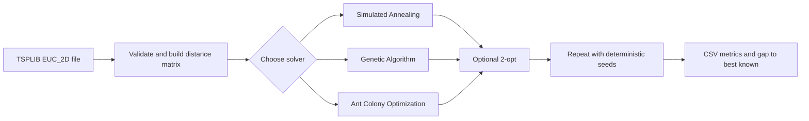

# TSP Optimization

> A reproducible C++17 benchmark for comparing three ways to solve the Traveling Salesman Problem.

The Traveling Salesman Problem (TSP) asks for the shortest route that visits every city once and returns to the start. This project compares **Simulated Annealing**, a **Genetic Algorithm**, and **Ant Colony Optimization** on standard TSPLIB instances ranging from 52 to 5,915 cities.

It is more than three algorithm implementations: it includes validated input handling, fair stopping rules, deterministic experiments, automated tests, CSV reporting, and benchmark visualizations.

## What this project demonstrates

| Area | Evidence in the project |
| --- | --- |
| Algorithm design | Three metaheuristics plus optional 2-opt local search |
| Experimental discipline | Equal-time and convergence-based benchmark modes |
| Reproducibility | Deterministic seeds derived for every algorithm, dataset, and repeat |
| Reliability | Parser validation, tour checks, CTest coverage, ASan, and UBSan presets |
| Performance engineering | Release builds, distance matrices, neighbor lists, and configurable search |
| Usability | One CLI, human-readable config files, grouped datasets, and CSV output |

## Results at a glance

Lower gap is better; **0% means the known best TSPLIB tour was found**.

| Dataset size | Cities | SA | GA | ACO | Best default |
| --- | ---: | ---: | ---: | ---: | --- |
| Small | 52–100 | **0.00%** | **0.00%** | **0.00%** | Tie |
| Medium | 130–280 | 0.16% | **0.00%** | 0.03% | GA |
| Large | 400–1,173 | 6.47% | **1.16%** | 2.42% | GA |
| Huge | 4,461–5,915 | 73.95% | 15.92% | **6.47%** | ACO |

These are average best gaps from the timed benchmark: 10 seconds per run for the small set and 60 seconds for the other sets. The release build ran on a local Darwin arm64 machine with seed `42` and three repeats.


The practical takeaway is simple: all three defaults solve the small instances reliably, GA is the strongest default on medium and large inputs, and ACO scales best to the largest inputs tested. SA is useful as a baseline, but its cooling schedule becomes expensive as the number of cities grows.

## How it works



| Solver | Search idea | Main techniques |
| --- | --- | --- |
| Simulated Annealing (SA) | Accepts some worse moves early to escape local minima | Temperature cooling, tour reversal, repeated restarts |
| Genetic Algorithm (GA) | Evolves a population of candidate tours | Tournament selection, order crossover, mutation, elitism |
| Ant Colony Optimization (ACO) | Builds tours from learned edge desirability | Candidate lists, pheromone evaporation, best-tour updates |

GA and ACO enable 2-opt by default. SA keeps it disabled by default so the effect of its cooling schedule remains visible.

## Quick start

You need CMake 3.21 or newer and a C++17 compiler.

```bash
cmake --preset release
cmake --build --preset release
ctest --test-dir build/release --output-on-failure
```

Run a short comparison of all three algorithms:

```bash
./build/release/tsp_optimizer \
  --benchmark-mode timed \
  --set small \
  --algorithm all \
  --time-limit 1s \
  --seed 42 \
  --repeats 1
```

The program prints progress to the terminal and writes the complete measurements to `results/*.csv`.

## Running experiments

### Equal-time comparison

Use timed mode when every solver should receive the same wall-clock budget:

```bash
./build/release/tsp_optimizer \
  --benchmark-mode timed \
  --set medium \
  --algorithm all \
  --params default \
  --time-limit 60s \
  --seed 42 \
  --repeats 3
```

### Run until improvement plateaus

Use stable mode to explore the quality each solver reaches under its own natural work cycle:

```bash
./build/release/tsp_optimizer \
  --benchmark-mode stable \
  --set small \
  --algorithm all \
  --min-iters 50 \
  --window 25 \
  --epsilon 0.0001 \
  --plateau-time 10s \
  --seed 42
```

Stable mode is intentionally **not** an equal-time comparison. GA and ACO check stability after generations or epochs; SA checks only after a complete annealing restart.

### Tune an algorithm

Parameters live in small `key = value` config files:

```conf
population = 100
mutation = 0.1
two_opt = true
```

Run a custom configuration like this:

```bash
./build/release/tsp_optimizer \
  --benchmark-mode timed \
  --set medium \
  --algorithm sa \
  --params custom \
  --config configs/sa/slow.conf \
  --time-limit 60s \
  --seed 42
```

Default configs are in `configs/default/`. SA also includes `fast`, `slow`, and `deep` cooling profiles in `configs/sa/`. Any solver's 2-opt setting can be overridden with `--two-opt true` or `--two-opt false`.

<details>
<summary><strong>CLI reference</strong></summary>

| Option | Values | Default or requirement |
| --- | --- | --- |
| `--benchmark-mode` | `timed`, `stable` | Required |
| `--set` | `small`, `medium`, `large`, `huge` | Required |
| `--algorithm` | `sa`, `ga`, `aco`, `all` | `all` |
| `--params` | `default`, `custom` | `default` |
| `--config` | File path | Required with `--params custom` |
| `--two-opt` | `true`, `false` | Uses the config value |
| `--seed` | Unsigned 32-bit integer | `42` |
| `--repeats` | Positive integer | `3`, or `1` for huge |
| `--label` | Output label | Empty |
| `--time-limit` | Seconds, such as `10s` | Required in timed mode |

Stable mode also accepts `--min-iters`, `--window`, `--epsilon`, `--plateau-time`, and `--max-iters`.

Run `./build/release/tsp_optimizer --help` for the complete usage text.

</details>

## Benchmark design

| Mode | Stops when | Best used for |
| --- | --- | --- |
| Timed | The wall-clock budget expires | Fair practical comparisons |
| Stable | Improvement remains below a threshold for a window and plateau period | Exploring solver convergence |

Every repeat receives a deterministic seed derived from the base seed, algorithm ID, dataset index, and repeat index. Runs are reproducible without giving different algorithms identical random streams.

The CSV output records the best and mean tour costs, standard deviation, gap to the known best solution, mean runtime, work units, and stop reason. Known best tour lengths come from `tsplib/solutions`.

### Included benchmark sets

| Set | Instances |
| --- | --- |
| Small | `berlin52`, `eil76`, `kroB100` |
| Medium | `ch130`, `d198`, `a280` |
| Large | `rd400`, `u574`, `rat783`, `pr1002`, `vm1084`, `pcb1173` |
| Huge | `fnl4461`, `rl5915` |

Only TSPLIB `EUC_2D` instances are supported.

## Engineering quality

The tests cover:

- TSPLIB parsing and malformed-input rejection
- rounded Euclidean distance and tour-cost calculation
- invalid and duplicate city IDs
- 2-opt correctness and non-regression
- GA crossover and mutation validity
- valid tours from SA, GA, and ACO
- timed and stable stopping behavior
- deterministic seed derivation
- CLI validation and error handling

For memory and undefined-behavior checks:

```bash
cmake --preset sanitizers
cmake --build --preset sanitizers
ctest --test-dir build/sanitizers --output-on-failure
```

## Project structure

```text
algorithms/       SA, GA, and ACO implementations
benchmark/        experiment runner and CSV reporting
benchmark_sets/   named groups of TSPLIB instances
configs/          default and custom solver parameters
core/             parsing, distances, 2-opt, seeds, and stop conditions
docs/assets/      benchmark charts
tests/            correctness and CLI tests
tools/            README chart generation
tsplib/           input instances and known best solutions
```

<details>
<summary><strong>More benchmark results</strong></summary>

### Stable mode

The stable benchmark shows the tradeoff between solution quality and the time each algorithm needs to stop improving.


| Set | SA gap / time | GA gap / time | ACO gap / time |
| --- | ---: | ---: | ---: |
| Small | 0.00% / 147.33s | 0.00% / 10.41s | 0.00% / 10.78s |
| Medium | 0.07% / 177.82s | 0.00% / 16.64s | 0.11% / 12.68s |
| Large | 6.19% / 184.04s | 1.18% / 51.13s | 2.65% / 21.42s |
| Huge | 72.43% / 634.25s | 3.96% / 313.95s | 6.24% / 34.92s |

Huge stable runs use one repeat because a complete SA restart is expensive on 4,000+ city inputs.

### SA cooling profiles

These 60-second, single-repeat experiments show why cooling is dataset-sensitive.


Deep cooling improves SA on the large set, reaching a 3.07% average gap. On the huge set, a chain may not cool enough within 60 seconds: the same profile ranges from an 18.60% gap on `rl5915` to 3,116.54% on `fnl4461`. The middle cooling rate is therefore the safer default.

### Measurement protocol

```text
build: Release (-O3), local Darwin arm64 machine
seed: 42
timed mode: 10s for small; 60s for medium, large, and huge
stable mode: min-iters=50, window=25, epsilon=0.0001, plateau-time=10s
default SA: start_temp=10000, end_temp=0.001, cooling=0.999999, two_opt=false
default GA: population=100, mutation=0.1, two_opt=true
default ACO: ants=20, alpha=1, beta=5, evaporation=0.3, two_opt=true
```

The numbers are hardware-dependent. They show relative behavior and benchmark discipline, not universal timing or state-of-the-art performance.

Regenerate the charts from the current CSV files with Python 3, NumPy, and Matplotlib:

```bash
python3 tools/generate_readme_assets.py
```

</details>

## Scope and limitations

- The solvers are heuristic, so they do not prove that a tour is optimal.
- Only `EUC_2D` TSPLIB files are supported.
- Results depend on hardware, time limits, and parameter choices.
- The project is designed for understandable experimentation, not state-of-the-art TSP claims.
